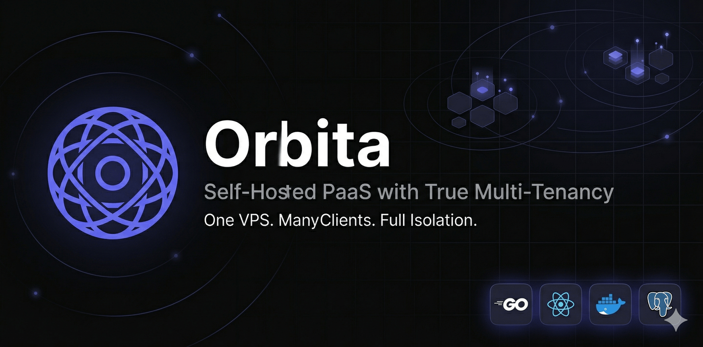

<p align="center">
  
</p>

<p align="center">
  
  <h1 align="center">Orbita</h1>
  <p align="center">
    <strong>Self-Hosted PaaS with True Multi-Tenancy</strong>
  </p>
  <p align="center">
    One VPS. Many Clients. Full Isolation.
  </p>
  <p align="center">
    <a href="#-installation">Installation</a> &middot;
    <a href="#-features">Features</a> &middot;
    <a href="#-cloud-deployment-guide">Deployment Guide</a> &middot;
    <a href="#-api-reference">API Reference</a> &middot;
    <a href="#-architecture">Architecture</a>
  </p>
  <p align="center">
    
    
    
    
  </p>
</p>

---

## What is Orbita?

Orbita is an open-source, self-hosted **Platform-as-a-Service (PaaS)** built in Go, designed for developers, freelancers, and agencies who manage infrastructure for multiple clients on a single server.

Turn a single VPS into a fully isolated hosting environment for multiple client organizations — each with their own dashboard, projects, environment variables, secrets, logs, domains, and resource quotas. Clients never see each other. You, as the super-admin, see everything.

**Ships as a single ~30MB binary** with an embedded React SPA. Uses **under 50MB of RAM** at idle.

### Why Orbita?

| Problem | Orbita's Solution |
|---------|-------------------|
| Dokploy/Coolify lack multi-tenancy | True tenant isolation: separate networks, secrets, volumes, quotas |
| No working invite/RBAC system | 4-role RBAC (Owner/Admin/Developer/Viewer) with email invites |
| High memory overhead (PHP/Node.js) | Go binary — under 50MB idle RAM |
| No resource quotas per client | cgroup v2 slices enforce CPU/memory limits per org |
| No cron job management | Built-in cron scheduler with run history and concurrency policies |
| Vendor lock-in with managed PaaS | 100% self-hosted, no per-seat fees, you own everything |

### How Orbita Compares

| Feature | Orbita | Dokploy | Coolify |
|---------|--------|---------|---------|
| Multi-tenancy | ✅ | ❌ | ❌ |
| Resource quotas (cgroups) | ✅ | ❌ | ❌ |
| Working invite system | ✅ | ❌ | Partial |
| RBAC (4 roles) | ✅ | ❌ | ❌ |
| Cron job manager | ✅ | ❌ | ❌ |
| Single binary deploy | ✅ | ❌ | ❌ |
| Idle memory usage | <50MB | ~200MB | ~500MB |
| Written in | Go | Node.js | PHP/Laravel |

---

## 🚀 Installation

### Requirements

Before installing Orbita, ensure your server meets these requirements:

| Requirement | Minimum | Recommended |
|-------------|---------|-------------|
| **CPU** | 1 vCPU | 2+ vCPU |
| **RAM** | 1 GB | 4 GB |
| **Disk** | 10 GB | 30+ GB |
| **OS** | Ubuntu 22.04, Debian 12, Fedora 38+, CentOS 9 | Ubuntu 24.04 |
| **Architecture** | 64-bit (AMD64 or ARM64) | — |
| **Ports** | 80, 443, 8080 open | — |

> **Important:** Use a fresh server whenever possible. If Apache, nginx, or another container is already bound to ports 80 or 443, the installer will detect it and offer to remove it — but the cleanest experience is a server with nothing else on it.

### Before You Install — Quick Checklist

If you want a smooth first install, run through this quickly:

| Check | Command | Expected |
|-------|---------|----------|
| OS is supported | `cat /etc/os-release` | Ubuntu 22.04+ / Debian 12+ / Fedora 38+ |
| Ports 80, 443, 8080 are free | `ss -ltnp \| grep -E ':80\|:443\|:8080'` | No output (or only your existing Orbita) |
| DNS points at the server | `getent hosts orbita.yourdomain.com` | Your server's IP |
| Cloudflare (if used) on DNS-only | DNS tab → record shows ☁️ **gray** not orange | Gray cloud = direct, needed for Let's Encrypt |
| Docker is version 24+ | `docker --version` | `Docker version 24.x` or higher |

If any of these fail, the installer handles most cases automatically — but knowing up-front saves a round-trip.

---

### Quick Installation (Recommended)

Run a single command to install Orbita on your server:

```bash
curl -sSL https://raw.githubusercontent.com/MUKE-coder/orbita/main/install.sh | sudo bash
```

This script will:
1. Install Docker (if not already installed)
2. Initialize Docker Swarm mode
3. Generate secure secrets automatically
4. Ask for your domain and email
5. Create `docker-compose.yml` and `.env` files
6. Start all services (Orbita + PostgreSQL + Redis + Traefik)
7. Verify the installation with a health check

After installation completes, open your server's IP in a browser at port `8080` and **register the first user** — they become the super admin.

```
  ╔═══════════════════════════════════════╗
  ║          Orbita Installer              ║
  ║    Self-Hosted PaaS with Multi-Tenancy ║
  ╚═══════════════════════════════════════╝

  [✓] Docker installed
  [✓] Swarm initialized
  [✓] Secrets generated
  [✓] Services started
  [✓] Health check passed

  Dashboard: http://your-server-ip:8080
```

---

### Docker Installation

If you prefer to set things up manually with Docker Compose:

```bash
# 1. Create project directory
mkdir -p /opt/orbita && cd /opt/orbita

# 2. Download the compose file
curl -sSL https://raw.githubusercontent.com/MUKE-coder/orbita/main/docker/docker-compose.prod.yml -o docker-compose.yml

# 3. Create .env with your secrets
cat > .env << EOF
DB_PASSWORD=$(openssl rand -hex 16)
JWT_SECRET=$(openssl rand -hex 32)
JWT_REFRESH_SECRET=$(openssl rand -hex 32)
ENCRYPTION_MASTER_KEY=$(openssl rand -hex 16)
APP_BASE_URL=https://your-domain.com
RESEND_API_KEY=re_your_key_here
RESEND_FROM_EMAIL=noreply@your-domain.com
ACME_EMAIL=admin@your-domain.com
EOF

# 4. Start everything
docker compose up -d

# 5. Verify
curl http://localhost:8080/health
# {"status":"ok","version":"0.1.0"}
```

---

### Binary Installation

For environments where you want maximum control:

```bash
# 1. Download the binary
curl -L -o /usr/local/bin/orbita \
  https://github.com/MUKE-coder/orbita/releases/latest/download/orbita-linux-amd64
chmod +x /usr/local/bin/orbita

# 2. Create config directory
mkdir -p /opt/orbita && cd /opt/orbita

# 3. Create .env (see Docker Installation above for template)

# 4. Create systemd service
cat > /etc/systemd/system/orbita.service << 'EOF'
[Unit]
Description=Orbita PaaS
After=network.target postgresql.service redis.service docker.service

[Service]
Type=simple
WorkingDirectory=/opt/orbita
ExecStart=/usr/local/bin/orbita
EnvironmentFile=/opt/orbita/.env
Restart=always
RestartSec=5

[Install]
WantedBy=multi-user.target
EOF

# 5. Start
systemctl daemon-reload
systemctl enable --now orbita

# 6. Check status
systemctl status orbita
```

> **Note:** Binary installation requires PostgreSQL 15+, Redis 7+, and Docker to be installed and running separately.

---

### Build from Source

```bash
git clone https://github.com/MUKE-coder/orbita.git && cd orbita

# Build frontend
cd web && npm install && npm run build && cd ..

# Build Go binary (~30MB)
go build -ldflags="-s -w" -o orbita ./cmd/server/

# Or build Docker image
docker build -t orbita:local .
```

---

### Installer Options

The installer supports flags and environment variables for automation, recovery, and customization. Each example below is a complete copy-pasteable command — just swap in your own domain/email/image.

**Default install (interactive):**

```bash
curl -sSL https://raw.githubusercontent.com/MUKE-coder/orbita/main/install.sh | sudo bash
```

---

#### `--force-reset` — Wipe everything and reinstall

Destroys all Orbita containers, volumes, and config, then runs a fresh install. Destructive — deletes Postgres metadata, encryption secrets, and TLS certs.

```bash
curl -sSL https://raw.githubusercontent.com/MUKE-coder/orbita/main/install.sh \
  | sudo bash -s -- --force-reset
```

#### `--yes` / `-y` — Skip all confirmation prompts

Auto-approves cleanup of port conflicts (Apache/nginx), stale containers, and reset prompts. Use for automation.

```bash
curl -sSL https://raw.githubusercontent.com/MUKE-coder/orbita/main/install.sh \
  | sudo bash -s -- --yes
```

#### `--help` / `-h` — Show installer help and exit

```bash
curl -sSL https://raw.githubusercontent.com/MUKE-coder/orbita/main/install.sh \
  | bash -s -- --help
```

#### `ORBITA_DOMAIN` — Skip the domain prompt

```bash
curl -sSL https://raw.githubusercontent.com/MUKE-coder/orbita/main/install.sh \
  | sudo ORBITA_DOMAIN=orbita.example.com bash
```

#### `ORBITA_ACME_EMAIL` — Skip the Let's Encrypt email prompt

```bash
curl -sSL https://raw.githubusercontent.com/MUKE-coder/orbita/main/install.sh \
  | sudo ORBITA_ACME_EMAIL=admin@example.com bash
```

#### `ORBITA_IMAGE` — Override the Docker image

Useful for forks, private registries, or pinning to a specific version tag. Default: `ghcr.io/muke-coder/orbita:latest`.

```bash
curl -sSL https://raw.githubusercontent.com/MUKE-coder/orbita/main/install.sh \
  | sudo ORBITA_IMAGE=ghcr.io/your-fork/orbita:v0.1.0 bash
```

#### `ORBITA_AUTO_CLEAN` — Auto-approve conflict cleanup

Same as `--yes` but only for the port-conflict / stale-container prompts.

```bash
curl -sSL https://raw.githubusercontent.com/MUKE-coder/orbita/main/install.sh \
  | sudo ORBITA_AUTO_CLEAN=yes bash
```

---

#### Fully non-interactive install (combine everything)

One shot, no prompts — ideal for CI, provisioning scripts, or fresh cloud images:

```bash
curl -sSL https://raw.githubusercontent.com/MUKE-coder/orbita/main/install.sh | sudo \
  ORBITA_DOMAIN=orbita.example.com \
  ORBITA_ACME_EMAIL=admin@example.com \
  bash -s -- --yes
```

#### Reset + reinstall in one command

```bash
curl -sSL https://raw.githubusercontent.com/MUKE-coder/orbita/main/install.sh | sudo \
  ORBITA_DOMAIN=orbita.example.com \
  ORBITA_ACME_EMAIL=admin@example.com \
  bash -s -- --force-reset --yes
```

---

#### Automatic conflict detection

The installer detects anything blocking ports 80, 443, or 8080 and offers to clean it up:

- **System web servers** (Apache, nginx, Caddy, lighttpd, httpd) — offers to stop, disable, and purge via `apt` / `dnf` / `yum`
- **Other Docker containers** — offers to remove the container
- **Stale Orbita containers** from a previous failed install — offers to run `docker compose down` and force-remove by name (volumes preserved)

Pass `--yes` or `ORBITA_AUTO_CLEAN=yes` to skip the prompts and auto-approve all cleanup.

---

### Post-Installation

After Orbita is running:

1. **Register Super Admin** — Open the dashboard and create the first account. This user automatically gets super admin privileges.

2. **Create Organization** — Click "Create Organization". Each org gets its own isolated Docker network, encryption keys, and resource quotas.

3. **Set Up DNS** — Point your domain (A record) and wildcard (`*.yourdomain.com`) to your server IP. Traefik handles SSL automatically via Let's Encrypt.

4. **Configure Email** _(optional)_ — Sign up at [resend.com](https://resend.com) and set your `RESEND_API_KEY` for invite emails, password resets, and deploy notifications.

5. **Deploy Your First App** — See the [Getting Started](#-getting-started) section below for a full walkthrough.

---

## 🚀 Getting Started

Step-by-step guide for using Orbita after the super admin is registered and the first organization exists.

### Core Concepts

Before deploying anything, it helps to understand the hierarchy:

```
Organization           ← tenant (isolated network, encryption keys, resource quota)
  └── Project          ← logical grouping (e.g., "my-saas")
        └── Environment  ← Production, Staging, or custom (e.g., "preview")
              ├── Apps      ← your running services
              ├── Databases ← managed Postgres/MySQL/Mongo/Redis
              └── Cron Jobs ← scheduled containers
```

Every resource you create belongs to **exactly one organization**. Members of other orgs can never see or access it.

### 1. Deploy Your First App

**From a Docker image (fastest):**

1. Go to **Apps** → **Create App**
2. Select a **Project** and **Environment** (create them if needed)
3. Source: **Docker Image**
4. Image: e.g. `nginx:alpine`, `ghcr.io/you/your-app:v1.2.3`
5. Port: the port your container listens on (e.g., `80` for nginx, `3000` for Node.js)
6. Click **Deploy**

Orbita pulls the image, starts it on a rolling update, attaches Traefik routing, and streams logs back to you. Deploys take ~10-30 seconds.

**From a Git repository (CI-style):**

1. Go to **Settings → Git Connections → Add Connection**
2. Choose GitHub / GitLab / Gitea and paste a **personal access token** with `repo` + `admin:repo_hook` scope
3. Back in **Apps → Create App**, pick **Git Repository** as the source
4. Choose your repo and branch
5. Build method: **Dockerfile** (if you have one) or **Nixpacks** (auto-detect)
6. Click **Deploy** — every push to the selected branch triggers an auto-deploy via webhook

### 2. Manage App Environment Variables

1. Open any app → **Env Variables** tab
2. Add key/value pairs — secrets are **encrypted at rest** with your org's derived AES-256 key
3. Or click **Import .env** and paste a full file
4. Changes take effect on next deploy (or click **Restart**)

### 3. Add a Custom Domain & SSL

1. App → **Domains** tab → **Add Domain**
2. Enter the domain (e.g., `api.yoursite.com`)
3. Point an **A record** at your server's IP
4. Orbita + Traefik automatically request a **Let's Encrypt certificate** on the first request. HTTP is redirected to HTTPS by default.

If the cert doesn't issue, check `docker compose logs orbita-traefik` — the most common cause is DNS not yet resolving to your server.

### 4. Provision a Managed Database

1. **Databases → Create Database**
2. Choose engine: **PostgreSQL 15/16**, **MySQL 8**, **MariaDB 10/11**, **MongoDB 6/7**, or **Redis 7**
3. Set size, name, and backup schedule (hourly / daily / weekly)
4. Click **Create**

Orbita generates strong credentials, encrypts them, exposes them as `${DB_NAME}_URL` variables, and spins up the container with a persistent volume. Click **Connection Info** to copy the connection string into your app.

**Backups**

- Manual: click **Create Backup** anytime
- Automatic: set a schedule with retention (e.g., keep 7 daily)
- Restore: pick a backup and click **Restore** (downtime of a few seconds)

### 5. Schedule a Cron Job

1. **Cron Jobs → Create Cron Job**
2. Image + command (e.g., `ghcr.io/you/billing-worker:latest` with arg `node run-billing.js`)
3. Schedule: standard cron syntax (`0 */6 * * *` = every 6 hours)
4. Concurrency policy:
   - **Allow** — run parallel instances
   - **Forbid** — skip if the previous run hasn't finished
   - **Replace** — kill previous and start new
5. Optional timeout (max runtime)

History shows the last 50 runs with exit code, duration, and log output. Use **Run Now** to trigger a job on demand for testing.

### 6. Deploy from the Service Marketplace

Pre-configured one-click services ready to deploy:

| Template | Purpose |
|----------|---------|
| WordPress | Blog / CMS |
| Plausible | Privacy-friendly analytics |
| Uptime Kuma | Status page & monitoring |
| n8n | Workflow automation |
| Metabase | BI dashboards |
| Grafana | Metrics visualization |
| MinIO | S3-compatible object storage |
| Gitea | Self-hosted Git |
| Ghost | Publishing / newsletters |
| Vaultwarden | Password manager (Bitwarden-compatible) |

**Marketplace → Pick a template → Fill parameters → Deploy.** Services launch inside your org's isolated network.

### 7. Invite Team Members

1. Organization → **Members → Invite Member**
2. Enter email + role:
   - **Owner** — full control including deleting the org
   - **Admin** — manage members, projects, git connections
   - **Developer** — create/deploy/manage apps, databases, cron jobs
   - **Viewer** — read-only access
3. Invitee receives a **cryptographically signed link** (72-hour expiry) via email
4. They click it, create an account, and are added to the org

### 8. Monitor & Debug Running Apps

- **Logs tab** — live-tailing stdout/stderr via WebSocket
- **Metrics tab** — CPU%, memory, network I/O charts (last 1h / 24h / 7d)
- **Terminal tab** — full xterm.js shell into the running container (no SSH needed)
- **Exec (API)** — run one-off commands programmatically:
  ```bash
  curl -X POST https://orbita.example.com/api/v1/orgs/$ORG/apps/$APP_ID/exec \
    -H "Authorization: Bearer $ORB_KEY" \
    -d '{"command":["rails","db:migrate"]}'
  ```
- **Deploy history** — every deployment is versioned. **Rollback** to any previous version in one click.

### 9. Scale Across Multiple Nodes

Super admin only:

1. **Admin → Nodes → Add Worker**
2. Provision a second VPS
3. Follow the on-screen SSH setup (Orbita installs Docker and joins Swarm)
4. Apps can now be scaled with `replicas: 3+` and scheduled across nodes

### 10. Use API Keys for CI/CD

1. Profile (top right) → **API Keys → Create Key**
2. Give it a name (e.g., `github-actions`) and scope
3. Copy the `orb_…` key — **it's shown only once**
4. Use it in automation:
   ```bash
   curl -H "Authorization: Bearer orb_…" \
     https://orbita.example.com/api/v1/orgs/my-org/apps/$APP_ID/deploy
   ```

---

## 🔧 Managing Your Install

### Updating Orbita

```bash
cd /opt/orbita
docker compose pull orbita
docker compose up -d orbita
```

Migrations run automatically on startup. Check `docker compose logs orbita --tail 50` to confirm.

### Backing Up Orbita Itself

The most important thing to back up is the Postgres database (it contains all your orgs, apps metadata, and encrypted secrets).

```bash
docker exec orbita-postgres pg_dump -U orbita orbita | gzip > orbita-backup-$(date +%F).sql.gz
```

Schedule this with cron — see the [Cloud Deployment Guide](#-cloud-deployment-guide) → Step 9 for a ready-made backup script.

### Resetting or Uninstalling

**Stop services** (keep all data — can restart later):

```bash
cd /opt/orbita
docker compose down
```

**Full reset** (destructive — wipes Postgres metadata, secrets, and certs):

```bash
curl -sSL https://raw.githubusercontent.com/MUKE-coder/orbita/main/install.sh \
  | sudo bash -s -- --force-reset
```

Or manually:

```bash
cd /opt/orbita
docker compose down -v            # -v drops all named volumes
cd /opt && sudo rm -rf orbita
```

**Complete removal** (also removes Docker and any apps Orbita deployed):

```bash
# WARNING: this deletes ALL Docker data on the host, not just Orbita's
docker system prune -a --volumes -f
apt purge -y docker-ce docker-ce-cli containerd.io docker-buildx-plugin docker-compose-plugin
apt autoremove -y
rm -rf /opt/orbita /var/lib/docker /etc/docker
```

> After a full reset, deployed apps keep running as Docker containers but
> are orphaned — the new Orbita install will not know about them. Remove
> them manually with `docker ps` + `docker rm -f`.

---

## 🛡️ Cloud Deployment Guide

A detailed, step-by-step guide for deploying Orbita on a cloud VPS or dedicated server.

### Step 1: Provision a Server

Get a VPS from any cloud provider:

| Provider | Recommended Plan | Notes |
|----------|-----------------|-------|
| **Hetzner** | CX22 (2 vCPU, 4GB RAM, €4.5/mo) | Best price/performance in EU |
| **DigitalOcean** | Basic Droplet (2 vCPU, 4GB, $24/mo) | Simple, reliable |
| **Vultr** | Cloud Compute (2 vCPU, 4GB, $24/mo) | Global locations |
| **Linode/Akamai** | Linode 4GB ($24/mo) | Good support |
| **AWS Lightsail** | 2 vCPU, 4GB ($32/mo) | AWS ecosystem |
| **OVH** | VPS Starter (2 vCPU, 4GB, €6/mo) | Budget EU option |

Choose **Ubuntu 24.04 LTS** as the operating system.

### Step 2: Connect to Your Server

```bash
ssh root@YOUR_SERVER_IP

# Create a non-root user (recommended)
adduser orbita
usermod -aG sudo orbita
su - orbita
```

### Step 3: Prepare the Server

```bash
# Update packages
sudo apt update && sudo apt upgrade -y

# Install essential tools
sudo apt install -y curl git ufw

# Configure firewall
sudo ufw allow OpenSSH
sudo ufw allow 80/tcp    # HTTP (Traefik)
sudo ufw allow 443/tcp   # HTTPS (Traefik)
sudo ufw enable

# Verify firewall
sudo ufw status
```

### Step 4: Install Docker

```bash
# Install Docker via official script
curl -fsSL https://get.docker.com | sh

# Add your user to the docker group
sudo usermod -aG docker $USER
newgrp docker

# Verify Docker
docker --version         # Docker 24+
docker compose version   # Docker Compose v2+

# Initialize Docker Swarm (required for service orchestration)
docker swarm init
```

### Step 5: Install Orbita

**Option A: One-Line Install (Recommended)**

```bash
curl -sSL https://raw.githubusercontent.com/MUKE-coder/orbita/main/install.sh | sudo bash
```

**Option B: Manual Install**

```bash
# Create directory
sudo mkdir -p /opt/orbita
sudo chown $USER:$USER /opt/orbita
cd /opt/orbita

# Download docker-compose.yml
curl -sSL https://raw.githubusercontent.com/MUKE-coder/orbita/main/docker/docker-compose.prod.yml -o docker-compose.yml

# Generate secrets
cat > .env << EOF
DB_PASSWORD=$(openssl rand -hex 16)
JWT_SECRET=$(openssl rand -hex 32)
JWT_REFRESH_SECRET=$(openssl rand -hex 32)
ENCRYPTION_MASTER_KEY=$(openssl rand -hex 16)
APP_BASE_URL=https://orbita.yourdomain.com
RESEND_API_KEY=re_your_key_here
RESEND_FROM_EMAIL=noreply@yourdomain.com
ACME_EMAIL=admin@yourdomain.com
EOF

# Start
docker compose up -d
```

### Step 6: Configure DNS

Point your domain to the server:

| Type | Name | Value | TTL |
|------|------|-------|-----|
| A | `orbita.yourdomain.com` | `YOUR_SERVER_IP` | 300 |
| A | `*.orbita.yourdomain.com` | `YOUR_SERVER_IP` | 300 |

The wildcard record (`*`) enables automatic subdomain routing for deployed apps (e.g., `myapp.orbita.yourdomain.com`).

```bash
# Verify DNS propagation
dig orbita.yourdomain.com +short
# Should return YOUR_SERVER_IP
```

### Step 7: Verify Installation

```bash
# Health check
curl -s http://localhost:8080/health
# {"status":"ok","version":"0.1.0"}

# Check all containers
docker compose ps
# NAME              STATUS
# orbita            Up
# orbita-postgres   Up (healthy)
# orbita-redis      Up (healthy)
# orbita-traefik    Up

# Check resource usage
docker stats --no-stream --format "table {{.Name}}\t{{.CPUPerc}}\t{{.MemUsage}}"
```

### Step 8: Register & Configure

1. Open `https://orbita.yourdomain.com` in your browser
2. Click **"Get Started"** to register
3. The **first user** automatically becomes the **super admin**
4. Create your first organization
5. Start deploying apps!

### Step 9: Security Hardening

```bash
# 1. Disable root SSH login
sudo sed -i 's/PermitRootLogin yes/PermitRootLogin no/' /etc/ssh/sshd_config
sudo systemctl restart sshd

# 2. Set up SSH key authentication (disable password auth)
# On your local machine:
ssh-copy-id orbita@YOUR_SERVER_IP

# 3. Enable automatic security updates
sudo apt install -y unattended-upgrades
sudo dpkg-reconfigure -plow unattended-upgrades

# 4. Set up automated database backups (daily at 2 AM)
cat > /opt/orbita/backup.sh << 'BKEOF'
#!/bin/bash
BACKUP_DIR="/opt/orbita/backups"
mkdir -p $BACKUP_DIR
docker exec orbita-postgres pg_dump -U orbita orbita | gzip > \
  $BACKUP_DIR/orbita-$(date +%Y%m%d-%H%M%S).sql.gz
find $BACKUP_DIR -name "*.sql.gz" -mtime +30 -delete
echo "Backup completed: $(date)"
BKEOF
chmod +x /opt/orbita/backup.sh
echo "0 2 * * * /opt/orbita/backup.sh >> /var/log/orbita-backup.log 2>&1" | sudo tee -a /etc/crontab

# 5. Monitor logs
docker compose logs -f orbita --tail 100
```

### Step 10: Updating Orbita

```bash
cd /opt/orbita

# Pull latest version
docker compose pull orbita

# Restart with zero downtime
docker compose up -d orbita

# Verify the update
curl -s http://localhost:8080/health

# Check logs for any migration messages
docker compose logs orbita --tail 20
```

### Troubleshooting

The installer handles the most common issues automatically (stale containers, ports 80/443 held by Apache/nginx, missing DNS record detection). The table below is for cases where something unusual happens — read top to bottom, most specific issues first.

#### Install fails with `error from registry: denied` pulling `ghcr.io/muke-coder/orbita`

The container image is private or hasn't been published. For self-hosters, either:

- Build the image locally and tell the installer to use it:
  ```bash
  cd /opt && git clone https://github.com/MUKE-coder/orbita.git orbita-src
  cd orbita-src && docker build -t orbita:local .
  ORBITA_IMAGE=orbita:local bash <(curl -sSL https://raw.githubusercontent.com/MUKE-coder/orbita/main/install.sh)
  ```
- Or `docker login ghcr.io` with a token that has `read:packages` if the image is private.

#### `address already in use` on port 80 or 443 during `docker compose up`

Something else is binding the port — usually Apache2 on Contabo/DigitalOcean images, sometimes nginx. The installer now detects this and offers to purge it. If you hit it manually:

```bash
ss -ltnp 'sport = :80'      # shows what's listening
ss -ltnp 'sport = :443'
# Common culprit: Apache — stop and remove it
systemctl stop apache2 && systemctl disable apache2
apt purge -y apache2 apache2-utils apache2-bin apache2-data
apt autoremove -y
```

Then `cd /opt/orbita && docker compose up -d`.

#### Traefik stuck with `client version 1.24 is too old`

Appears if your Docker Engine is version 28+ and Traefik's Docker SDK is older than v3.5. Fixed in the current compose template (uses `traefik:v3.6.14`). If you have an old install, upgrade Traefik:

```bash
cd /opt/orbita
sed -i 's|image: traefik:v3.0|image: traefik:v3.6.14|' docker-compose.yml
docker compose up -d --force-recreate traefik
```

#### Browser shows `ERR_TOO_MANY_REDIRECTS` on the dashboard

Either:
- **Browser cache** — try Incognito / Private window; if it works, clear cookies for the domain.
- **An old Orbita image before the SPA-serving fix** — upgrade:
  ```bash
  cd /opt/orbita
  docker compose pull orbita && docker compose up -d orbita
  ```

#### SSL certificate never issues (padlock stays broken / "Not secure")

Check Traefik's ACME logs:

```bash
cd /opt/orbita
docker compose logs traefik --tail 50 | grep -iE "acme|certificate|error"
```

Common causes:

| Symptom in log | Fix |
|----------------|-----|
| `unable to generate a certificate... DNS problem` | DNS not propagated. Run `getent hosts orbita.yourdomain.com` — should return your server IP. Wait and retry. |
| `HTTP 404 from challenge endpoint` | Cloudflare is proxying your DNS record (orange cloud). Switch the `orbita` A-record to **DNS only** (gray cloud). |
| `connection refused` on :80 | Firewall blocking port 80. `ufw allow 80/tcp && ufw allow 443/tcp && ufw reload`. |
| `rate limit exceeded` | Let's Encrypt 5-certs/week/domain limit. Wait an hour. |
| Nothing ACME-related in logs | Traefik isn't reading your labels. Confirm `--providers.docker=true` is in the `traefik` command section of `docker-compose.yml`. |

#### `Failed to retrieve information of the docker client and server host` in Traefik logs

Same as "client version 1.24 is too old" above — bump Traefik to `v3.6.14`.

#### Frontend loads but dashboard shows `404 page not found` from Traefik

Traefik is routing to the wrong place or not matching the Host rule. Verify:

```bash
# Check the label has the right hostname
docker inspect orbita --format '{{index .Config.Labels "traefik.http.routers.orbita.rule"}}'
# Should be: Host(`your-domain.com`) — not Host(`localhost`)
```

If it says `localhost`, your `ORBITA_HOST` isn't set. Fix in `/opt/orbita/.env`:
```
ORBITA_HOST=orbita.yourdomain.com
APP_BASE_URL=https://orbita.yourdomain.com
```
Then: `docker compose up -d --force-recreate orbita`.

#### Containers restart in a loop

```bash
docker compose ps            # see which service
docker compose logs <service> --tail 100
```

Most often:
- **orbita** → DB connection failed (check `DATABASE_URL` in `.env`) or migration error.
- **postgres** → old volume with mismatched credentials. `docker compose down -v` wipes data then re-install.
- **traefik** → config error. Re-generate compose via installer.

#### General diagnostics

```bash
cd /opt/orbita
docker compose ps                                    # all 4 healthy?
docker compose logs orbita --tail 50                 # backend
docker compose logs traefik --tail 50                # routing + SSL
ss -ltnp 'sport = :443'                              # is Traefik bound?
curl -I http://localhost:8080/health                 # does the backend respond?
curl -I https://orbita.yourdomain.com                # does the outside world?
```

#### Base table (legacy short-form)

| Problem | Solution |
|---------|----------|
| Can't connect to port 8080 | Firewall: `ufw allow 8080/tcp`. Then `ss -ltnp 'sport = :8080'`. |
| "permission denied" on Docker socket | `sudo usermod -aG docker $USER && newgrp docker` |
| High memory | `docker stats --no-stream` |

---

## ✨ Features

### Core Platform

- **Multi-Tenancy & Organizations** — Fully isolated tenants with separate Docker networks, encryption keys, volume namespaces, and database-level scoping
- **RBAC (4 Roles)** — Owner, Admin, Developer, Viewer with API-level enforcement
- **Team Invites** — Cryptographically secure invite tokens via email (72h expiry)
- **Projects & Environments** — Logical grouping with auto-created Production + Staging environments
- **Resource Plans** — Super admin defines plans (Free/Starter/Pro/Enterprise) with CPU, RAM, disk, app limits

### Application Deployment

- **Docker Image Deploy** — Deploy from Docker Hub, GHCR, or any registry
- **Git Auto-Deploy** — Connect GitHub, GitLab, or Gitea. Auto-deploy on push via webhooks
- **Build Engine** — Build from Dockerfile or Nixpacks
- **Zero-Downtime Deploys** — Rolling updates via Docker Swarm with rollback to any previous version
- **Deploy History** — Versioned deployment records with status, trigger type, timestamps
- **App Lifecycle** — Start, stop, restart, scale replicas

### Database Management

- **One-Click Provisioning** — PostgreSQL 15/16, MySQL 8, MariaDB 10/11, MongoDB 6/7, Redis 7
- **Auto-Generated Credentials** — Strong passwords, encrypted connection strings
- **Scheduled Backups** — Hourly/daily/weekly with configurable retention
- **Backup & Restore** — Create manual backups, restore from any point

### Cron Jobs

- **Scheduled Containers** — Docker containers on a cron schedule that run and exit
- **Concurrency Policies** — Allow, Forbid (skip if running), Replace (kill previous)
- **Run History** — Last 50 executions with status, exit code, duration, logs
- **Manual Trigger** — "Run Now" for immediate execution
- **Timeout Enforcement** — Configurable max runtime per job

### Domains & SSL

- **Custom Domains** — Assign to apps, databases, and services
- **Automatic TLS** — Let's Encrypt via Traefik ACME
- **HTTP → HTTPS Redirect** — Automatic with security headers
- **DNS Verification** — Built-in DNS lookup

### Service Marketplace

- **10 Pre-Built Templates** — WordPress, Plausible, Uptime Kuma, n8n, Metabase, Grafana, MinIO, Gitea, Ghost CMS, Vaultwarden
- **Parameterized Deploys** — Configurable parameters per template
- **One-Click Deploy** — Select, fill params, deploy

### Monitoring & Observability

- **Real-Time Metrics** — CPU%, memory, network I/O per container
- **Dashboard Overview** — Running apps, databases, cron jobs, resource usage
- **Log Streaming** — Real-time log viewer
- **In-Browser Terminal** — xterm.js SSH into running containers
- **Shell Exec** — Run one-off commands via API

### Security

- **JWT Authentication** — 15-min access + 30-day refresh tokens (httpOnly cookies)
- **bcrypt Hashing** — Cost 12
- **AES-256-GCM Encryption** — Secrets encrypted at rest with per-org HKDF-SHA256 derived keys
- **Rate Limiting** — Redis sliding window (5/15min on auth)
- **CORS** — Restricted to configured origin
- **Org-Scoped Queries** — Every query includes `organization_id`
- **Webhook Signatures** — HMAC-SHA256 verification
- **API Keys** — `orb_` prefix keys for CI/CD

### Notifications & Audit

- **In-App Notifications** — Bell icon with unread count
- **Audit Logs** — Every action logged with user, resource, IP, timestamp
- **Paginated History** — Searchable audit trail per org

### Infrastructure

- **Multi-Node** — Add workers via SSH, Docker Swarm orchestration
- **cgroup Slicing** — Per-org CPU/memory limits via cgroup v2
- **Node Management** — Add, drain, remove nodes

---

## 🛠️ Tech Stack

### Backend

| Component | Technology |
|-----------|------------|
| Language | Go 1.22+ |
| HTTP | Gin |
| ORM | GORM + PostgreSQL 15 |
| Cache | Redis 7 |
| Auth | JWT (golang-jwt v5) |
| Email | Resend API |
| Containers | Docker SDK |
| Proxy | Traefik v3 |
| Cron | robfig/cron v3 |
| WebSocket | gorilla/websocket |
| Migrations | golang-migrate |
| Logging | zerolog |

### Frontend

| Component | Technology |
|-----------|------------|
| Framework | React 18 + TypeScript |
| Build | Vite |
| Styling | Tailwind CSS v4 + shadcn/ui |
| State | Zustand |
| Data | TanStack Query |
| Forms | React Hook Form + Zod |
| Terminal | xterm.js |

**Build output:** Single Go binary with embedded React SPA (`//go:embed`)

---

## 📡 API Reference

All endpoints prefixed with `/api/v1`. Auth via `Authorization: Bearer <token>`.

### Authentication
| Method | Endpoint | Description |
|--------|----------|-------------|
| POST | `/auth/register` | Register new user |
| POST | `/auth/login` | Login (returns JWT) |
| POST | `/auth/logout` | Logout |
| POST | `/auth/refresh` | Refresh access token |
| POST | `/auth/forgot-password` | Request OTP |
| POST | `/auth/reset-password` | Reset with OTP |
| POST | `/auth/verify-email` | Verify email |

### Profile & Sessions
| Method | Endpoint | Description |
|--------|----------|-------------|
| GET/PUT | `/me` | Get/update profile |
| POST | `/me/change-password` | Change password |
| GET | `/me/sessions` | List sessions |
| DELETE | `/me/sessions/:id` | Revoke session |
| GET/POST/DELETE | `/me/api-keys` | API key management |

### Organizations
| Method | Endpoint | Description |
|--------|----------|-------------|
| GET/POST | `/orgs` | List/create |
| GET/PUT/DELETE | `/orgs/:slug` | CRUD |
| GET | `/orgs/:slug/members` | List members |
| POST | `/orgs/:slug/invites` | Send invite |
| PUT | `/orgs/:slug/members/:userId/role` | Change role |
| POST | `/orgs/:slug/leave` | Leave org |

### Projects
| Method | Endpoint | Description |
|--------|----------|-------------|
| GET/POST | `/orgs/:slug/projects` | List/create |
| GET/PUT/DELETE | `/orgs/:slug/projects/:id` | CRUD |
| GET/POST | `/orgs/:slug/projects/:id/environments` | Environments |

### Applications
| Method | Endpoint | Description |
|--------|----------|-------------|
| GET/POST | `/orgs/:slug/apps` | List/create |
| GET/PUT/DELETE | `/orgs/:slug/apps/:id` | CRUD |
| POST | `/orgs/:slug/apps/:id/deploy` | Deploy |
| POST | `/orgs/:slug/apps/:id/rollback/:deployId` | Rollback |
| POST | `/orgs/:slug/apps/:id/stop\|start\|restart` | Lifecycle |
| GET | `/orgs/:slug/apps/:id/deployments` | History |
| GET | `/orgs/:slug/apps/:id/logs\|metrics\|status` | Monitoring |
| POST | `/orgs/:slug/apps/:id/exec` | Run command |
| GET | `/orgs/:slug/apps/:id/terminal` | WebSocket terminal |
| GET/POST/DELETE | `/orgs/:slug/apps/:id/env` | Env vars |
| GET/POST/DELETE | `/orgs/:slug/apps/:id/domains` | Domains |

### Databases
| Method | Endpoint | Description |
|--------|----------|-------------|
| GET/POST | `/orgs/:slug/databases` | List/create |
| GET/DELETE | `/orgs/:slug/databases/:id` | Get/delete |
| POST | `/orgs/:slug/databases/:id/restart\|stop\|start` | Lifecycle |
| GET/POST | `/orgs/:slug/databases/:id/backups` | Backup mgmt |
| POST | `/orgs/:slug/databases/:id/backups/:id/restore` | Restore |

### Cron Jobs
| Method | Endpoint | Description |
|--------|----------|-------------|
| GET/POST | `/orgs/:slug/cron-jobs` | List/create |
| GET/PUT/DELETE | `/orgs/:slug/cron-jobs/:id` | CRUD |
| POST | `/orgs/:slug/cron-jobs/:id/toggle\|run` | Toggle/trigger |
| GET | `/orgs/:slug/cron-jobs/:id/runs` | Run history |

### Services & Templates
| Method | Endpoint | Description |
|--------|----------|-------------|
| GET | `/templates` | List marketplace templates |
| GET/POST | `/orgs/:slug/services` | List/deploy |
| GET/DELETE | `/orgs/:slug/services/:id` | Get/delete |

### Dashboard & Monitoring
| Method | Endpoint | Description |
|--------|----------|-------------|
| GET | `/orgs/:slug/dashboard` | Overview data |
| GET | `/orgs/:slug/metrics/overview` | Resource usage |
| GET | `/orgs/:slug/notifications` | Notifications |
| GET | `/orgs/:slug/audit-logs` | Audit trail |

### Admin (Super Admin Only)
| Method | Endpoint | Description |
|--------|----------|-------------|
| GET/POST/PUT/DELETE | `/admin/plans` | Resource plans |
| GET | `/admin/orgs` | All organizations |
| PUT | `/admin/orgs/:slug/plan` | Assign plan |
| GET/POST/DELETE | `/admin/nodes` | Node management |
| GET | `/admin/platform/metrics` | Platform overview |

### Webhooks (Public)
| Method | Endpoint | Description |
|--------|----------|-------------|
| POST | `/webhooks/github` | GitHub push events |
| POST | `/webhooks/gitlab` | GitLab events |
| POST | `/webhooks/gitea` | Gitea events |

---

## 🏗️ Architecture

```
┌─────────────────────────────────────────────────────────┐
│                     Orbita Binary (~30MB)                │
│  ┌─────────────┐  ┌──────────────┐  ┌───────────────┐  │
│  │  Gin Router  │  │  React SPA   │  │ Cron Scheduler │  │
│  │  (REST API)  │  │  (Embedded)  │  │ (robfig/cron) │  │
│  └──────┬───────┘  └──────────────┘  └───────┬───────┘  │
│         │                                     │          │
│  ┌──────┴───────────────────────────────────┴───────┐   │
│  │              Service Layer (10 services)          │   │
│  │  Auth │ Org │ Project │ App │ DB │ Cron │ Domain  │   │
│  └──────┬────────────────────────────────────────────┘   │
│         │                                                │
│  ┌──────┴───────────────────────────────────────────┐   │
│  │         Repository Layer (GORM + OrgScope)        │   │
│  └──────┬────────────────────────────────────────────┘   │
└─────────┼────────────────────────────────────────────────┘
          │
    ┌─────┴─────┐     ┌──────────┐     ┌──────────────┐
    │ PostgreSQL │     │  Redis   │     │ Docker Engine│
    │  (22 tables)│     │ (Cache)  │     │ (Containers) │
    └───────────┘     └──────────┘     └──────┬───────┘
                                              │
                                       ┌──────┴───────┐
                                       │   Traefik    │
                                       │ (TLS + Proxy)│
                                       └──────────────┘
```

### Directory Structure

```
orbita/
├── cmd/server/main.go          # Entry point
├── cmd/migrate/main.go         # Migration CLI
├── internal/
│   ├── api/handlers/           # 12 handler groups
│   ├── auth/                   # JWT, bcrypt, AES-256-GCM
│   ├── config/                 # Env config loader
│   ├── cron/                   # Scheduler + executor
│   ├── database/               # GORM + migrations
│   ├── docker/                 # Docker SDK wrapper
│   ├── mailer/                 # Resend client
│   ├── middleware/             # Auth, RBAC, rate limit
│   ├── models/                 # 15 GORM models
│   ├── orchestrator/           # Deploy, provision, build
│   ├── repository/             # 10 data access repos
│   ├── service/                # 10 business logic services
│   ├── traefik/                # Dynamic config writer
│   └── websocket/              # WS hub + terminal
├── migrations/                 # 22 SQL files
├── web/src/                    # React SPA (25+ pages)
├── install.sh                  # One-line installer
├── Dockerfile                  # Multi-stage build
├── Makefile                    # Dev targets
└── .env.example                # Config template
```

### Database Schema (22 migrations, 28 tables)

| Category | Tables |
|----------|--------|
| **Auth** | users, sessions, email_verifications, password_resets, api_keys |
| **Orgs** | organizations, org_members, org_invites, resource_plans |
| **Projects** | projects, environments |
| **Apps** | applications, deployments |
| **Data** | managed_databases, backups, backup_schedules |
| **Cron** | cron_jobs, cron_runs |
| **Infra** | domains, nodes, env_variables, git_connections, registry_credentials |
| **System** | templates, services, notifications, notification_settings, audit_logs |

---

## 🧑‍💻 Development

```bash
# Clone
git clone https://github.com/MUKE-coder/orbita.git && cd orbita

# Start PostgreSQL + Redis
docker compose -f docker/docker-compose.dev.yml up -d

# Configure
cp .env.example .env
# Edit .env — set JWT_SECRET, JWT_REFRESH_SECRET, ENCRYPTION_MASTER_KEY

# Run backend (with hot reload)
make dev

# Run frontend (separate terminal)
cd web && npm install && npm run dev
```

| Command | Description |
|---------|-------------|
| `make dev` | Start with Air hot-reload |
| `make build` | Build production binary |
| `make migrate` | Run migrations |
| `make test` | Run tests |
| `make lint` | Run linter |
| `make docker-up` | Start dev services |
| `make docker-down` | Stop dev services |

---

## Contributing

1. Fork the repository
2. Create a feature branch: `git checkout -b feature/my-feature`
3. Make your changes
4. Run tests: `make test`
5. Commit: `git commit -m "Add my feature"`
6. Push: `git push origin feature/my-feature`
7. Open a Pull Request

---

## License

MIT License — see [LICENSE](LICENSE) for details.

---

<p align="center">
  <strong>Orbita</strong> — Self-Hosted PaaS with True Multi-Tenancy
  <br/>
  Built with Go, React, and a lot of coffee.
  <br/><br/>
  <a href="https://github.com/MUKE-coder/orbita">⭐ Star on GitHub</a>
</p>
