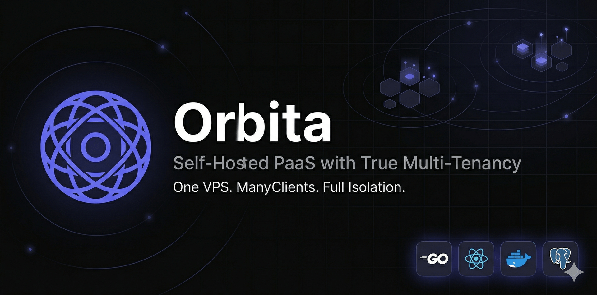

<p align="center">
  
</p>

<p align="center">
  
</p>

<h1 align="center">Orbita</h1>

<p align="center"><strong>Self-hosted, multi-tenant PaaS — and the control plane for Grit Cloud.</strong></p>
<p align="center">One VPS. Many clients. Full isolation. Secure a server and deploy a full Grit app in two commands.</p>

<p align="center">
  
  
  
  
  
</p>

<p align="center">
  <a href="#what-is-orbita">What</a> ·
  <a href="#why-orbita-exists">Why</a> ·
  <a href="#architecture">Architecture</a> ·
  <a href="#the-two-command-setup">Setup</a> ·
  <a href="#install-manually-on-a-fresh-server">Manual install</a> ·
  <a href="#troubleshooting--common-errors">Troubleshooting</a>
</p>

---

## What is Orbita?

**Orbita is an open-source, self-hosted Platform-as-a-Service (PaaS)** written in Go. It turns a
single VPS into a fully isolated hosting environment for many client organizations — each with
their own dashboard, projects, environment variables, secrets, logs, domains, databases, and
resource quotas. Clients never see each other; you, the super-admin, see everything.

It ships as a **single ~30 MB binary** with the React dashboard embedded, and idles under
**50 MB of RAM** — leaving nearly all of your server for the apps you actually run.

Orbita is also the **control plane for Grit Cloud**: because a [Grit](https://github.com/MUKE-coder)
app has a *known shape*, Orbita can build, route, migrate, and observe it with zero
hand-configuration. Two commands take you from a bare, unsecured server to a hardened box running
a live, migrated, HTTPS app:

```bash
grit cloud init      # interactive: secures the server + installs Orbita on a subdomain
grit deploy          # build → migrate (advisory lock) → route → live
```

After the first deploy, every `git push` auto-deploys via webhook.

---

## Why Orbita exists

Freelancers and agencies — Orbita's core audience — run many clients on one cheap box. The
existing self-hosted PaaS tools don't fit that, and managed platforms are expensive and opaque:

| Problem | How Orbita solves it |
|---|---|
| **Dokploy / Coolify have no multi-tenancy** | True tenant isolation: per-org Docker networks, per-org encryption keys, cgroup v2 quotas, 4-role RBAC |
| **No resource caps per client** | cgroup v2 slices enforce CPU/memory limits per organization |
| **Heavy runtimes** (PHP/Node control planes) | A single Go binary, <50 MB idle |
| **Generic, opaque deploys** — you still hand-write Dockerfiles, ports, env, migrations | **Grit-awareness**: Orbita reads the app's shape and wires the build, addons, domains, and migrations itself |
| **Fiddly, many-command server setup** | One interactive command hardens the server *and* installs Orbita |

### How it compares

| | Orbita | Dokploy | Coolify |
|---|:---:|:---:|:---:|
| Multi-tenancy | ✅ | ❌ | ❌ |
| Resource quotas (cgroups) | ✅ | ❌ | ❌ |
| RBAC (4 roles) + invites | ✅ | ❌ | Partial |
| Grit-aware zero-config deploys | ✅ | ❌ | ❌ |
| One-command secure + install | ✅ | Partial | ❌ |
| Single-binary control plane | ✅ | ❌ | ❌ |
| Idle memory | **<50 MB** | ~200 MB | ~500 MB |
| Written in | Go | Node.js | PHP/Laravel |

---

## Architecture

Orbita is a strictly layered Go service with an embedded SPA, orchestrating Docker Swarm and
Traefik on the host.

```
                              ┌──────────────────────────────────────────┐
   grit CLI  ───HTTPS/orb_──▶ │             Orbita binary (~30 MB)         │
   (laptop)                   │                                            │
   browser   ───HTTPS──────▶  │   Gin router → Handlers → Services         │
                              │        │            │                      │
                              │   Middleware   Orchestrator (Docker SDK)    │
                              │   (auth/RBAC)       │        │             │
                              │        │       Traefik writer  cgroup mgr   │
                              │   Repositories (GORM, org-scoped)           │
                              │   Embedded React SPA (//go:embed)           │
                              └──────┬───────────────┬───────────┬─────────┘
                                     │               │           │
                              ┌──────▼─────┐  ┌───────▼────┐  ┌───▼────────────┐
                              │ PostgreSQL │  │   Redis    │  │  Docker Engine  │
                              │ (metadata) │  │ (cache/RL) │  │  + Swarm        │
                              └────────────┘  └────────────┘  └───┬────────────┘
                                                                  │
                                                           ┌──────▼──────┐
                                                           │   Traefik   │
                                                           │  TLS + proxy │
                                                           └─────────────┘
```

**Layers (never skipped):** `Gin router → handlers → services → repositories → PostgreSQL`.
Handlers only validate and call services; business logic lives in services; repositories run
org-scoped GORM queries. The **orchestrator** wraps the Docker SDK (build, deploy, provision,
cgroup slicing); the **Traefik writer** emits dynamic routing config.

**Multi-tenancy invariants:** every tenant query is scoped by `organization_id`; each org gets
its own Docker network, cgroup slice, and AES-256 key (HKDF-derived from a master key + org ID);
volumes, container names, and Traefik routers are prefixed with the org slug.

**Grit-awareness:** `internal/grit` detects a Grit app from `grit.json`, derives its services and
build recipe (reusing the Dockerfiles Grit ships), and the `GritService` reconciles addons + env +
domains and runs migrations under a Postgres advisory lock before cutover.

**Tech stack:** Go 1.25 · Gin · GORM · PostgreSQL 16 · Redis 7 · Docker SDK + Swarm · Traefik v3 ·
JWT · Resend · React 19 + Vite + Tailwind v4 + shadcn/ui · xterm.js.

---

## The two-command setup

The whole point: a beginner shouldn't run a dozen commands. Install the `grit` CLI on your
laptop, then:

### Command 1 — `grit cloud init` (interactive)

```bash
grit cloud init
```

It **asks you a few questions** and does everything else:

```
▸ Grit Cloud — set up Orbita on your server
? Do you already have a server (a fresh Ubuntu 24.04 VPS)?  [Y/n] y
? Server IP address  203.0.113.10
  ✔ Server is reachable
? How do you log into the server right now?
  › 1) I have a root password (from my hosting provider)
    2) I added an SSH key when I created the VPS
? Root password:  ••••••••
? Create a secure deploy user named  [deploy]
? SSH key for the deploy user:
  › 1) Generate a new key for me (recommended)
    2) Paste an existing public key
? Domain for the Orbita dashboard (blank = use the server IP)  orbita.example.com
  ✔ DNS points here — we'll set up HTTPS at https://orbita.example.com
? Email for Let's Encrypt (TLS certificates)  [admin@orbita.example.com]
? Your email for the Orbita admin login  you@example.com
? Proceed?  [Y/n] y
```

Under the hood it: updates the server → **hardens it** (new sudo `deploy` user, generates an SSH
key, disables root + password login, UFW, Fail2ban, prints a security score) → installs Docker +
Orbita + Traefik on your **HTTPS subdomain** (or the server IP if DNS isn't pointed yet) →
creates your admin login + an `orb_` deploy token → registers the host in `~/.grit/hosts.yaml`.

When it finishes it prints your dashboard URL, login, and the deploy key path.

> **Automate it** with flags + `--yes` (for CI/scripts): `grit cloud init --server root@IP
> --domain orbita.example.com --acme-email you@example.com --admin-email admin@example.com --yes`.

### Command 2 — `grit deploy`

From your Grit project directory (it has a `grit.json`):

```bash
grit cloud github-auth      # once: store a GitHub token (repo + admin:repo_hook)
grit deploy --host prod
```

If there's no `grit.yaml`, a first-run wizard creates one. Then `grit deploy` ensures the repo,
reconciles infrastructure (org/project/env, **Postgres/Redis/MinIO** addons, env + secrets,
domains), builds each service from the Dockerfiles Grit ships, runs migrations **under a Postgres
advisory lock** (aborting if they fail), and cuts over:

```
✔ Live
  App:       https://rental.example.com
  API:       https://api.rental.example.com
  Pulse:     https://api.rental.example.com/pulse/ui
  Sentinel:  https://api.rental.example.com/sentinel/ui
  Auto-deploy is on: future `git push` to main redeploys via webhook.
```

Supporting commands: `grit deploy --plan` (dry run), `grit logs -f`, `grit rollback`,
`grit cloud status`, `grit cloud dashboard` (private SSH tunnel).

### `grit.yaml` — the deploy manifest

You write this once; everything else is inferred from `grit.json` + the repo.

```yaml
app: rental
repo: MUKE-coder/rental
addons: [postgres, redis]
domains:
  web: rental.example.com
  api: api.rental.example.com
migrate: true
env:
  from: .env.production   # values encrypted into Orbita, never committed
```

---

## Install manually on a fresh server

Prefer to do it by hand (no CLI)? This is the step-by-step for a fresh **Ubuntu 24.04** VPS.

### 0. Prerequisites

- Ports **80, 443, 8080** open. A domain with an `A` record pointed at the server IP.

> **Verify DNS first:** `dig orbita.example.com +short` must return your server IP — Let's
> Encrypt can't issue a certificate until it does.

### 1. Secure the server (optional but recommended)

```bash
ssh root@YOUR_SERVER_IP
apt update && apt install -y git
git clone https://github.com/MUKE-coder/vps-harden.git && cd vps-harden
sudo ./vps-harden.sh --no-dokploy      # new user + SSH keys, UFW, Fail2ban, score/100
```

### 2. Install Docker + Swarm

```bash
curl -fsSL https://get.docker.com | sh
docker swarm init
```

### 3. Install Orbita

```bash
curl -sSL https://raw.githubusercontent.com/MUKE-coder/orbita/main/install.sh \
  | sudo ORBITA_DOMAIN=orbita.example.com ORBITA_ACME_EMAIL=you@example.com bash -s -- --yes
```

### 4. Verify

```bash
curl -s http://localhost:8080/health          # {"status":"ok","version":"0.1.0"}
curl -I https://orbita.example.com            # 200 from the outside world
```

Open `https://orbita.example.com`, **register the first user** (they become super-admin), and
create your first organization.

---

## Troubleshooting / common errors

<details>
<summary><strong>Install fails: <code>denied</code> pulling <code>ghcr.io/muke-coder/orbita</code></strong></summary>

The image is private/unpublished for your fork. Build locally and point the installer at it:

```bash
cd /opt && git clone https://github.com/MUKE-coder/orbita.git orbita-src
cd orbita-src && docker build -t orbita:local .
ORBITA_IMAGE=orbita:local bash <(curl -sSL https://raw.githubusercontent.com/MUKE-coder/orbita/main/install.sh)
```
</details>

<details>
<summary><strong><code>address already in use</code> on port 80 / 443</strong></summary>

Usually Apache2 (Contabo/DO images) or nginx holds the port:

```bash
systemctl stop apache2 && systemctl disable apache2
apt purge -y apache2 apache2-utils apache2-bin apache2-data && apt autoremove -y
cd /opt/orbita && docker compose up -d
```
</details>

<details>
<summary><strong>SSL certificate never issues</strong></summary>

```bash
cd /opt/orbita && docker compose logs traefik --tail 50 | grep -iE "acme|certificate|error"
```

| Log symptom | Cause → Fix |
|---|---|
| `DNS problem` / `NXDOMAIN` | DNS not propagated. `dig orbita.example.com +short` must return the server IP. |
| `HTTP 404` from challenge | **Cloudflare orange cloud**. Set the record to **DNS only** (gray) until the cert issues. |
| `connection refused` on :80 | Firewall. `ufw allow 80/tcp && ufw allow 443/tcp && ufw reload` |
| `rate limit exceeded` | Let's Encrypt 5 certs/week/domain. Wait; avoid delete/re-add loops. |
</details>

<details>
<summary><strong><code>grit cloud init</code>: can't connect / hardening locked me out</strong></summary>

- **Can't connect initially:** double-check the IP, and that you picked the right auth (root
  password vs. an SSH key you actually added at VPS creation).
- **After hardening, root SSH is disabled by design.** Reconnect as the deploy user with the
  generated key: `ssh -i ~/.ssh/orbita_deploy deploy@YOUR_SERVER_IP`. To re-run install only,
  add `--skip-harden`.
</details>

<details>
<summary><strong>Grit deploy: app crash-loops with <code>password authentication failed</code></strong></summary>

A managed DB was deleted and re-created with the same name, reusing a stale volume. Current
Orbita removes the volume on delete. For an old orphan:
`docker volume rm <orgslug>_<dbname>_data` after removing the DB service.
</details>

<details>
<summary><strong>Grit deploy: migrations failed, deploy aborted</strong></summary>

**By design** — Orbita won't cut over to a schema-mismatched image. `grit logs -f --host prod` to
see the migrator; fix and redeploy. Common cause: the app's `go.sum` isn't committed.
</details>

Full guide: **[docs/TLS-TROUBLESHOOTING.md](docs/TLS-TROUBLESHOOTING.md)** and the
**[website docs](website/)**.

---

## Documentation

- **Website + full docs:** the [`website/`](website/) directory (VitePress landing page + docs).
- **[Quickstart](docs/QUICKSTART.md)** · **[grit.yaml spec](docs/GRIT-YAML.md)** · **[grit cloud CLI](docs/GRIT-CLOUD-CLI.md)** · **[Grit Cloud API](docs/GRIT-API.md)**

---

## Development

```bash
git clone https://github.com/MUKE-coder/orbita.git && cd orbita
make docker-up                 # Postgres + Redis for local dev
cp .env.example .env           # set JWT_SECRET, JWT_REFRESH_SECRET, ENCRYPTION_MASTER_KEY
make dev                       # backend with Air hot-reload
cd web && npm install && npm run dev   # dashboard on :5173

make build       # build web + embed + Go binary (~30 MB)
make build-cli   # build the grit CLI
make test        # go test ./... -race
```

| Path | What |
|---|---|
| `cmd/server` | control-plane entry point |
| `cmd/grit` | the `grit` CLI (cloud + deploy) |
| `internal/{api,service,repository,orchestrator}` | layered core |
| `internal/grit` | Grit-awareness (detect / build recipe / plan) |
| `migrations/` | numbered SQL migrations (source of truth for schema) |
| `web/` | React 19 dashboard (embedded at build time) |
| `website/` | landing page + docs (VitePress) |

---

## License

MIT — see [LICENSE](LICENSE).

<p align="center"><sub>Orbita — self-hosted PaaS with true multi-tenancy, and the control plane for Grit Cloud.</sub></p>
